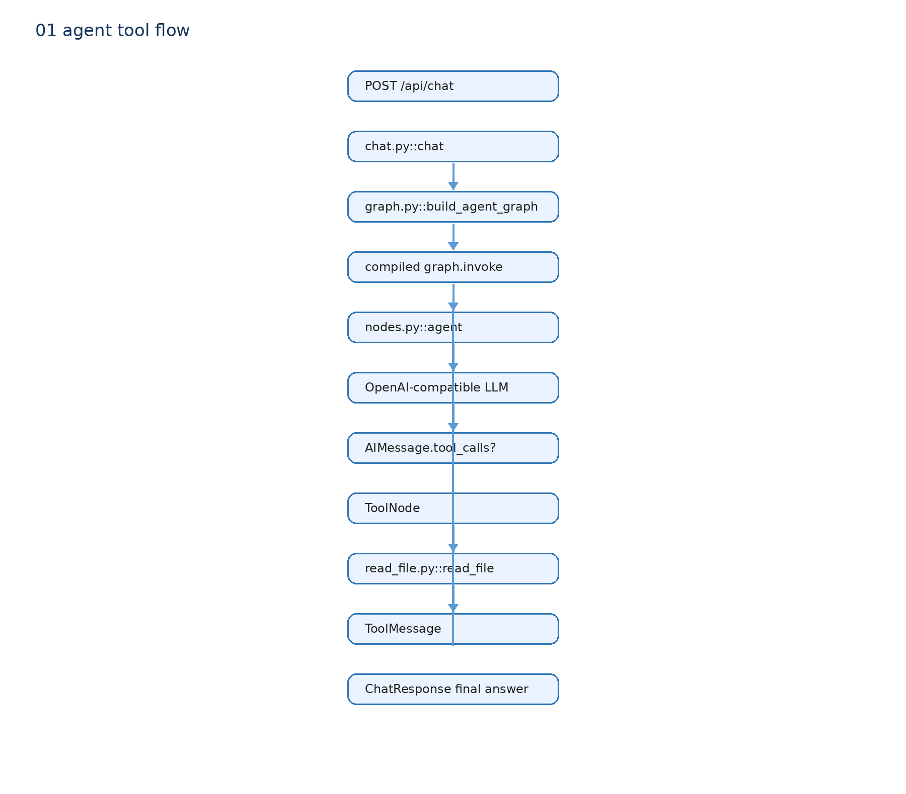

# 01 一次请求怎样走到最终回答



## 概念是什么

本项目的入口是 `POST /api/chat`。浏览器或 curl 传入 JSON：

```json
{"message": "请读取 note.txt"}
```

V1 只返回普通 JSON，不使用 SSE。它要证明的是最小主链：HTTP 请求变成 LangGraph State，模型可以选择调用 Tool，Tool 结果再进入模型，最后返回答案。

## 为什么需要这条链

直接调用一次 LLM 只能回答模型已有知识。Coding Agent 必须能够在需要时读取外部文件，因此要有一个循环：模型先决定要不要调用工具，程序执行工具，模型看见结果后继续回答。

## 我的项目怎么实现

```text
app/api/chat.py::chat
→ app/agent/graph.py::build_agent_graph
→ compiled_graph.invoke({messages: [HumanMessage]})
→ app/agent/nodes.py::agent
→ bound_model.invoke(SystemMessage + state.messages)
→ AIMessage
→ route_after_agent
→ ToolNode 或 END
→ ChatResponse(answer)
```

`chat()` 的输入是 `ChatRequest.message`，输出是 `ChatResponse.answer`。它每次请求创建一张很小的图，调用同步 `graph.invoke()`，读取最后一个 AIMessage 的内容返回 JSON。

没有 Tool Call 时，图走：`START → agent → END`。这就是本轮先证明的普通 Chat 路径：HTTP → FastAPI → LLM → Final Answer。

有 Tool Call 时，图走：`START → agent → tools → agent → END`。具体循环见 [03 Tool Calling](03-tool-calling.md)。

## 面试怎么说

我先用一个同步 JSON 接口跑通最小 Agent 主链。FastAPI 只负责输入输出，LangGraph 负责状态和节点跳转，节点调用 OpenAI-compatible 模型；模型不需要工具时直接结束，需要工具时才进入 ToolNode 并回到模型。
